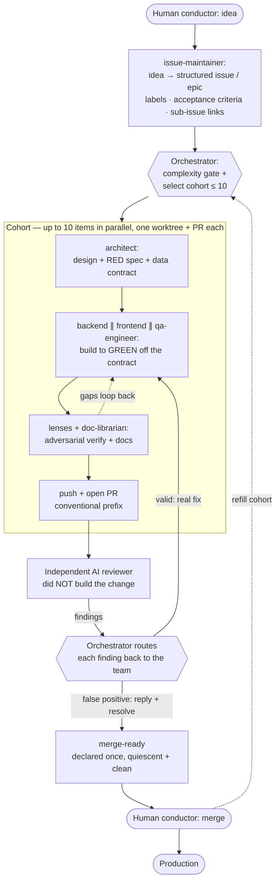
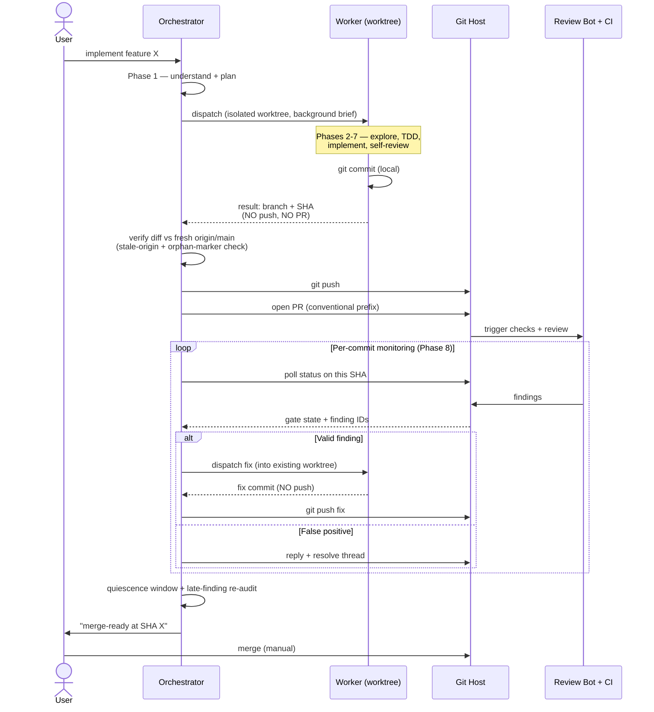
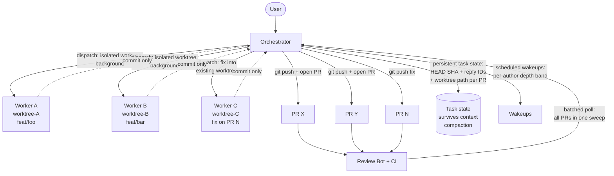

# Wizard v2 — Architecture

This document holds the architectural narrative and the flow diagrams for the wizard v2
orchestration workflow. The SKILL (`skill/SKILL.md`) stays focused on actionable directives —
*what* to do at each phase. This file captures *why* those directives exist and *how* the moving
pieces fit together.

## The escalation: one disciplined developer → an orchestrated team

Wizard v1 was a single-skill "think before it codes" prompt — it turned one Claude thread from a
fast coder into a careful one (read first, test first, attack your own code). v2 keeps all of that
and adds a second axis: when the work is big enough, the careful thread stops being the *builder*
and becomes the **orchestrator** of a team of specialist agents that build and verify in parallel.

Three structural ideas carry the whole design:

1. **The orchestrator/worker split**, with the boundary at `git commit`.
2. **The agent ensemble** — gate-routed, mediated, generator-≠-evaluator.
3. **The parallel pipeline** — wait windows are work-time.

All three exist to do one thing the single-thread v1 couldn't: ship multiple correct PRs at once
without any one of them cutting a corner.

## The big picture: the full development cycle with the human as conductor

Before the detailed views below, here is the end-to-end cycle. The most important actor is the
**human conductor**: they bring the *idea*, make the product/judgment calls, unblock, and merge —
they do not write tasks or code. Everything between "idea" and "merge button" is delegated to the
ensemble and integrated by the orchestrator. The orchestrator drives a **cohort of up to ten
items** through this cycle concurrently, refilling as PRs merge; the AI-review loop feeds every
finding back to the team before anything is declared merge-ready.

This is the orchestration shape at altitude. The three diagrams that follow are the **detailed
views** of its mechanics: the orchestrator/worker split on a single PR, the parallel-pipeline
fan-out, and the commit/push two-phase boundary.

## Threading model: why the boundary is `git commit`, not `git push` or "PR opened"

Delegated mode splits responsibility between the **orchestrator** (the conversation thread the
user talks to) and a **worker subagent**. The boundary lives at the `git commit` line: the worker
commits locally; the orchestrator does everything from `git push` onward.

A natural-feeling alternative — "the worker does everything through PR-open, then the orchestrator
takes over monitoring" — is *not* the design. The boundary lives at the commit line because it is
the **two-phase-commit point** between local work (fully reversible at zero cost) and external
commitments (CI fires, reviewers get notified, the host records check-runs against the SHA).
Splitting there buys five concrete things:

1. **Verify the diff before exposing it.** The orchestrator sanity-checks the branch before push,
   catching a stale-origin false-deletion diff (a worker that branched before sibling merges
   landed) or orphan conflict markers — before a PR opens with a confusing diff.
2. **Enforce backpressure at the moment of external visibility.** The per-author depth band is
   enforced at *spawn*, but the *visible* count only changes when a PR opens. Auto-pushing workers
   would race each other to push with no chance to stagger.
3. **Compose the PR title/body with cross-cut context.** The worker knows what it built; the
   orchestrator knows what else is open, what conventional prefix the versioning policy needs, and
   which sibling findings to reference.
4. **Clean failure recovery.** A worker that crashes before pushing leaves recoverable local work;
   one that crashed *after* pushing leaves a half-open PR, an unknown branch state, and CI on
   incomplete code.
5. **Single monitoring owner.** "The user merges manually" needs exactly ONE entity that knows the
   full state of all in-flight PRs, so it declares merge-ready once per PR instead of N threads
   racing.

The same boundary holds for fix-cycle subagents on already-open PRs: the worker commits the fix
locally; the orchestrator pushes + replies + resolves as one atomic unit, so the findings gate
never sees a fresh push with no replies.

## The agent ensemble: gate-routed, mediated, generator ≠ evaluator

The ensemble is an **orchestrator-workers** topology with a **prompt-chaining** spine. Two
properties govern everything:

- **The complexity gate fires first.** No agent is spawned until the work is classified into a
  band on four structural signals (AC count, builder-distinct domain count, shared-state
  *mutation*, lifecycle *transition*) — never a keyword match. Band 1 (trivial) takes a single
  general-purpose subagent and the ensemble never spawns; only Band 3 runs the full chain. A
  7-spawn ensemble on a one-line fix is malpractice — the gate's job is to *justify* the
  multi-agent tax, not assume it.
- **Every hand-off is orchestrator-mediated.** Subagents run in isolated contexts and return one
  result; they do NOT talk peer-to-peer. The orchestrator reads each agent's output and bakes the
  relevant slice into the next agent's brief. It is the integrator.

The chain separates the agents that *build* a change from the ones that *sign off* on it. The
architect designs and writes the RED spec but no production code; the builders turn the spec
GREEN; an independent qa-engineer pass and the persona lenses verify the assembled result. That
generator-≠-evaluator separation is the containment seam: every builder's output is checked
against a concrete failing test the architect specified, not against the builder's own reading of
the brief.

## Visualization 1 — orchestrator/worker split (single-PR delegated mode)

## Visualization 2 — the parallel-pipeline shape

The orchestrator is the single coordinator; workers are siloed by worktree. Many wait windows are
spent orchestrating multiple in-flight workstreams rather than pausing.

Two invariants from this picture:

- Every arrow from a worker into the orchestrator with a commit is **dotted** — workers NEVER push
  directly.
- There is exactly ONE batched-poll arrow back from the reviewers, not one per PR — the
  orchestrator sweeps all in-flight PRs in a single iteration.

## Visualization 3 — the commit/push boundary (two-phase commit)

```mermaid
graph LR
    subgraph WorkerTerritory["Worker territory — LOCAL, reversible"]
        direction TB
        S1[understand]
        S2[explore]
        S3[RED tests]
        S4[GREEN]
        S5[verify]
        S6[docs]
        S7[self-review]
        S8[git commit]
        S1 --> S2 --> S3 --> S4 --> S5 --> S6 --> S7 --> S8
    end

    subgraph OrchestratorTerritory["Orchestrator territory — EXTERNAL, costly to reverse"]
        direction TB
        M1[verify diff<br/>fetch origin/main<br/>grep conflict markers]
        M2[git push]
        M3[open PR<br/>conventional prefix]
        M4[monitor loop<br/>reply / resolve / fix]
        M5[merge-ready<br/>declaration<br/>at named SHA]
        M1 --> M2 --> M3 --> M4 --> M5
    end

    S8 -.return: branch + SHA.-> M1

    style S8 fill:#cfc,stroke:#0a0,stroke-width:2px
    style M1 fill:#ffe,stroke:#aa0,stroke-width:2px
```

The two boxes never overlap. The green node (`git commit`) is the only legitimate output of the
worker. The yellow node (`verify diff`) is the only legitimate entry to orchestrator territory.

## Markdown / documentation gotchas worth knowing

- **Anchor links target hash headings only.** A bold-text "section title" produces no anchor; a
  cross-reference to it is a dead link. Promote it to a real heading, or use a plain-text
  reference.
- **Heading levels increment by one.** Going from `##` directly to `####` trips most markdown
  linters — and review bots flag it.
- **Code blocks consumed one-at-a-time don't share state.** If two separate shell blocks in a doc
  share a variable, an operator who pastes only the second block has an empty variable. Either
  duplicate the definition in each block (with a comment marking it deliberate) or define it once
  in a clearly-marked preamble block.

## Related

- `skill/SKILL.md` — the executable playbook (actionable directives).
- `reference/threading-model.md` — the orchestrator/worker boundary + failure recipes.
- `reference/parallel-pipeline.md` — the wakeup algorithm + depth band.
- `reference/pr-review-cycle.md` — the per-commit loop + merge-ready gate.
- `agents/` — the specialist roster.
