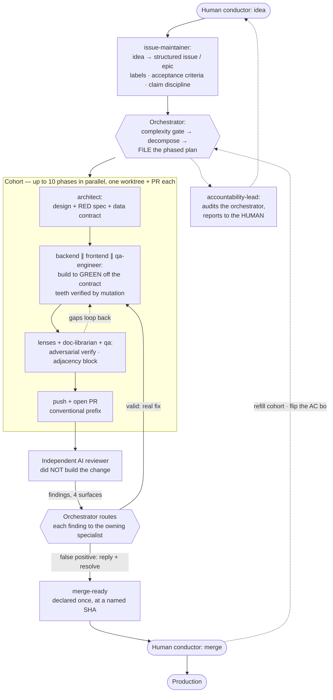
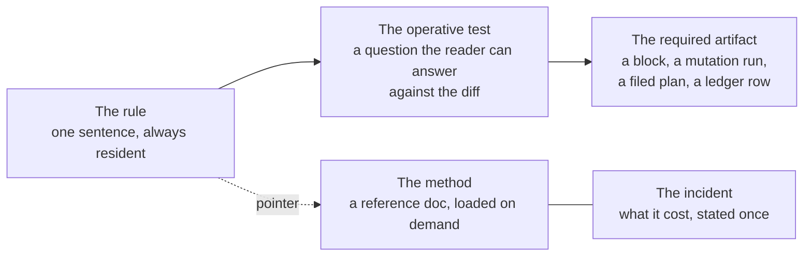
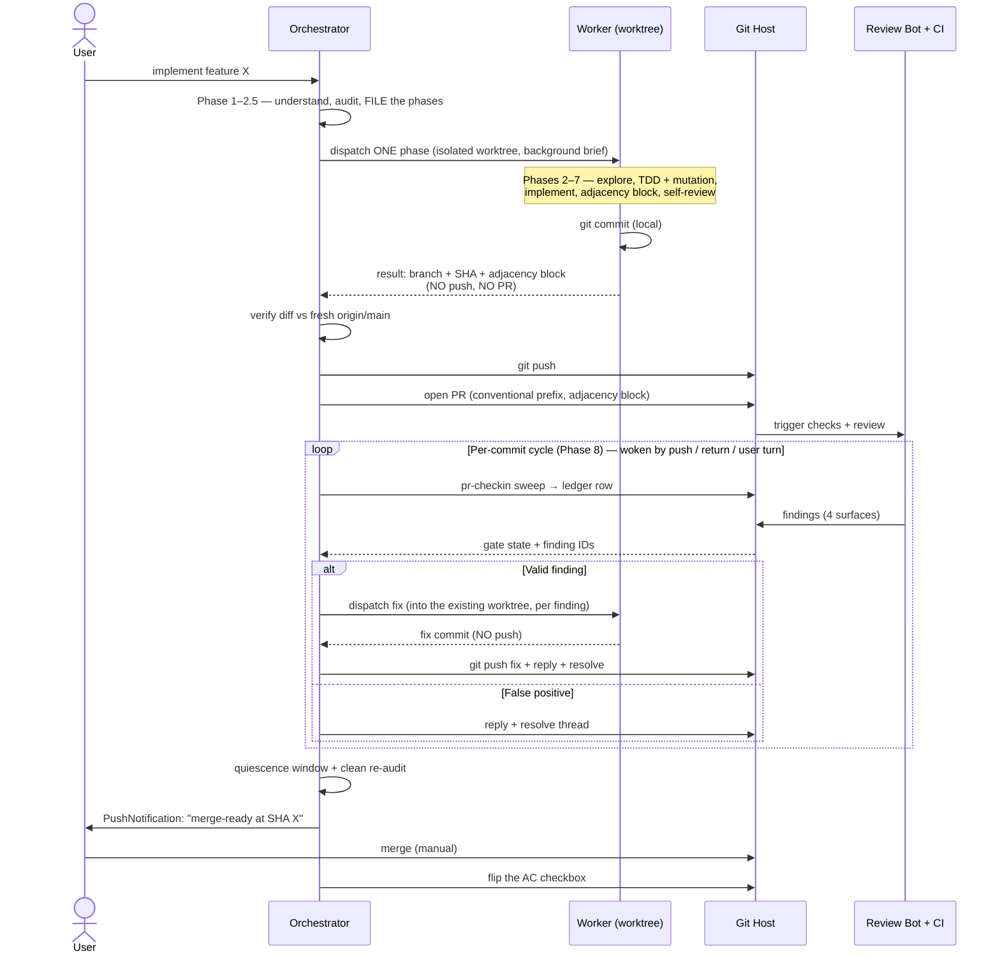
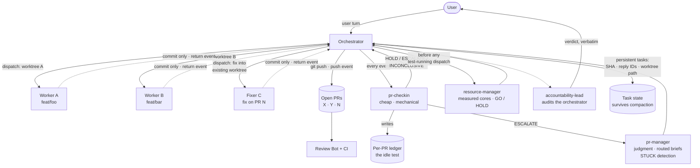

# Wizard v3 — Architecture

This document holds the architectural narrative and the flow diagrams for the wizard orchestration
workflow. The SKILL (`skill/SKILL.md`) stays focused on actionable directives — *what* to do at
each phase, as a summary plus a pointer. This file captures *why* those directives exist and *how*
the moving pieces fit together.

## The escalation: one developer → an orchestrated team → a team that audits itself

Wizard v1 was a single-skill "think before it codes" prompt — it turned one Claude thread from a
fast coder into a careful one. v2 kept all of that and added a second axis: when the work is big
enough, the careful thread becomes the **orchestrator** of specialist agents that build and verify
in parallel. v3 keeps both and adds a third: **the loop measures and audits itself**, because three
months of production use showed that every rule stated as guidance was eventually violated from
inside a loop where every turn looked like progress.

Five structural ideas carry the design:

1. **The orchestrator/worker split**, with the boundary at `git commit` (v2).
2. **The agent ensemble** — gate-routed, mediated, generator ≠ evaluator (v2).
3. **The filed artifact** — a rule becomes an ordered step that must produce something durable:
   a phased plan on the issue, a mutation actually run, an adjacency block in the PR body, a
   ledger entry per sweep (v3).
4. **Event-driven orchestration** — wakes ride events that already exist; the idle test is a
   durable ledger, not an empty event queue (v3).
5. **Independent auditors** — a cheap check-in that writes the ledger, a manager that judges only
   on escalation, a capacity gate that measures, and a second lead that audits the first and
   reports to the human (v3).

All five exist to do one thing: ship many correct PRs at once without any one of them cutting a
corner — and notice, from outside the loop, when a corner is being cut anyway.

## The big picture: the full cycle with the human as conductor

The most important actor is the **human conductor**: they bring the *idea*, make the
product/judgment calls, unblock, and merge — they do not write tasks or code. The orchestrator
drives a **cohort of up to ten items** through this cycle concurrently, refilling as PRs merge.

```mermaid
flowchart TB
    Human([Human conductor: idea])
    Maintainer[issue-maintainer:<br/>idea → structured issue / epic<br/>labels · acceptance criteria · claim discipline]
    Orch{{Orchestrator:<br/>complexity gate → decompose →<br/>FILE the phased plan}}

    Human --> Maintainer --> Orch

    subgraph Cohort["Cohort — up to 10 phases in parallel, one worktree + PR each"]
        direction TB
        Arch[architect:<br/>design + RED spec + data contract]
        Build[backend ∥ frontend ∥ qa-engineer:<br/>build to GREEN off the contract<br/>teeth verified by mutation]
        Verify[lenses + doc-librarian + qa:<br/>adversarial verify · adjacency block]
        PR[push + open PR<br/>conventional prefix]
        Arch --> Build --> Verify --> PR
    end

    Orch --> Cohort

    Review[Independent AI reviewer<br/>did NOT build the change]
    PR --> Review
    Review -->|findings, 4 surfaces| Route{{Orchestrator routes<br/>each finding to the owning specialist}}
    Route -->|valid: real fix| Build
    Route -->|false positive: reply + resolve| Ready
    Ready[merge-ready<br/>declared once, at a named SHA]
    Verify -.gaps loop back.-> Build

    Audit[accountability-lead:<br/>audits the orchestrator,<br/>reports to the HUMAN]
    Audit -.-> Human
    Orch -.-> Audit

    Ready --> Merge([Human conductor: merge])
    Merge --> Prod([Production])
    Merge -.refill cohort · flip the AC box.-> Orch
```

## Threading model: why the boundary is `git commit`, not `git push` or "PR opened"

Delegated mode splits responsibility between the **orchestrator** (the conversation thread the
user talks to) and a **worker subagent**. The worker commits locally; the orchestrator does
everything from `git push` onward. The commit line is the **two-phase-commit point** between local
work (fully reversible at zero cost) and external commitments (CI fires, reviewers get notified,
the host records check-runs against the SHA). Splitting there buys five concrete things:

1. **Verify the diff before exposing it** — a stale-origin false-deletion diff or an orphan
   conflict marker is caught before a PR opens.
2. **Enforce backpressure at the moment of external visibility** — the depth band is enforced at
   spawn, but the visible count only changes at PR-open; auto-pushing workers would race.
3. **Compose the PR with cross-cut context** — the worker knows what it built; the orchestrator
   knows what else is open, which prefix the versioning policy needs, and which sibling findings
   to reference.
4. **Clean failure recovery** — a worker that crashes before pushing leaves recoverable local
   work; one that crashed after pushing leaves a half-open PR and CI on incomplete code.
5. **Single monitoring owner** — "the user merges manually" needs exactly ONE entity that knows
   the state of every in-flight PR, so it declares merge-ready once per PR.

In v3 the orchestrator's side of the line hardened further: **it authors no repo code in delegated
mode** — not even a one-line assertion edit. The "provably trivial" carve-out was retired because
every trivial edit serialized work a subagent could have done in parallel.

## The agent ensemble: gate-routed, mediated, generator ≠ evaluator

Two properties govern everything:

- **The complexity gate fires first.** No agent is spawned until the work is classified on four
  structural signals (AC count, builder-distinct domain count, shared-state *mutation*, lifecycle
  *transition*). Band 1 takes a single subagent and the ensemble never spawns; only Band 3 runs
  the full chain. A seven-spawn ensemble on a one-line fix is malpractice.
- **Every hand-off is orchestrator-mediated.** Subagents run in isolated contexts and return one
  result; they do NOT talk peer-to-peer. The orchestrator is the integrator.

v3 adds two refinements. **The gate decides how many AGENTS; decomposition decides how many PRs** —
independent questions, so a multi-concern footprint is phased and filed at every band. And
**routing within a band is hybrid**: a cheap triage agent emits a task manifest; builders route
deterministically off its objective signals; the read-only lenses self-select from it — the
judgment-heavy, cross-cutting signal where central routing kept failing.

The chain separates the agents that *build* a change from the ones that *sign off* on it. That
generator-≠-evaluator separation is the containment seam: every builder's output is checked against
a concrete failing test the architect specified, and every test's teeth are proven by a mutation
that was actually run.

## The principle ladder: how a v3 rule is shaped

Every v3 rule with teeth has the same shape, and the four portable principles show it best:

```mermaid
flowchart LR
    Rule[The rule<br/>one sentence, always resident]
    Test[The operative test<br/>a question the reader can answer<br/>against the diff]
    Artifact[The required artifact<br/>a block, a mutation run,<br/>a filed plan, a ledger row]
    Method[The method<br/>a reference doc, loaded on demand]
    Incident[The incident<br/>what it cost, stated once]

    Rule --> Test --> Artifact
    Rule -.pointer.-> Method
    Method --- Incident
```

- **Absence is not a value** — test: *if this read comes back empty, what number does the user
  see?* Artifact: a refusal (sentinel, throw, or durable operator-visible record), asserted in a
  test that keeps a genuine `0` distinguishable from no-sample.
- **Remove the mechanism, don't add a guard** — test: *could a new caller written next year still
  do the wrong thing?* Artifact: the highest rung taken, and the rung named in the PR when it is
  only a guard.
- **A test asserts behavior, not success** — test: *which test goes red if I break this on
  purpose?* Artifact: the one-line mutation, run and edited back.
- **The adjacency check** — test: *what did I just make true, and where else was that already
  stated? which guard covers what I rely on, and can it fire here?* Artifact: the
  `### Adjacency check` block in the PR body.

The summary + pointer discipline is what keeps this affordable: the rule and its test stay in the
always-resident file; the method and the incident live in a reference doc that is read only when
the rule applies.

## Visualization 1 — orchestrator/worker split (single-PR delegated mode)

```mermaid
sequenceDiagram
    actor User
    participant Main as Orchestrator
    participant Sub as Worker (worktree)
    participant Host as Git Host
    participant Rev as Review Bot + CI

    User->>Main: implement feature X
    Main->>Main: Phase 1–2.5 — understand, audit, FILE the phases
    Main->>Sub: dispatch ONE phase (isolated worktree, background brief)
    Note over Sub: Phases 2–7 — explore, TDD + mutation,<br/>implement, adjacency block, self-review
    Sub->>Sub: git commit (local)
    Sub-->>Main: result: branch + SHA + adjacency block<br/>(NO push, NO PR)

    Main->>Main: verify diff vs fresh origin/main
    Main->>Host: git push
    Main->>Host: open PR (conventional prefix, adjacency block)
    Host->>Rev: trigger checks + review

    loop Per-commit cycle (Phase 8) — woken by push / return / user turn
        Main->>Host: pr-checkin sweep → ledger row
        Rev->>Host: findings (4 surfaces)
        Host-->>Main: gate state + finding IDs
        alt Valid finding
            Main->>Sub: dispatch fix (into the existing worktree, per finding)
            Sub-->>Main: fix commit (NO push)
            Main->>Host: git push fix + reply + resolve
        else False positive
            Main->>Host: reply + resolve thread
        end
    end

    Main->>Main: quiescence window + clean re-audit
    Main->>User: PushNotification: "merge-ready at SHA X"
    User->>Host: merge (manual)
    Main->>Host: flip the AC checkbox
```

## Visualization 2 — the event-driven pipeline with its auditors

The orchestrator is the single coordinator; workers are siloed by worktree. Nothing here fires on a
clock: each wake rides an event that already exists, and the ledger — not the event queue — says
whether there is work.

```mermaid
graph TB
    User([User])
    Main[Orchestrator]
    User -->|user turn| Main

    Main -->|dispatch: worktree A| SubA[Worker A<br/>feat/foo]
    Main -->|dispatch: worktree B| SubB[Worker B<br/>feat/bar]
    Main -->|dispatch: fix into<br/>existing worktree| SubC[Fixer C<br/>fix on PR N]

    SubA -.commit only · return event.-> Main
    SubB -.commit only · return event.-> Main
    SubC -.commit only · return event.-> Main

    Main -->|git push · push event| PRs[(Open PRs<br/>X · Y · N)]
    PRs --> Rev[Review Bot + CI]

    Main -->|every event| Checkin[pr-checkin<br/>cheap · mechanical]
    Checkin -->|HOLD / ESCALATE /<br/>INCONCLUSIVE| Main
    Checkin -->|writes| Ledger[(Per-PR ledger<br/>the idle test)]
    Checkin -->|ESCALATE| Manager[pr-manager<br/>judgment · routed briefs<br/>STUCK detection]
    Manager --> Main

    Main -->|before any<br/>test-running dispatch| Cap[resource-manager<br/>measured cores · GO / HOLD]
    Cap --> Main

    Lead[accountability-lead<br/>audits the orchestrator]
    Main -.-> Lead
    Lead -->|verdict, verbatim| User

    Main -->|persistent tasks:<br/>SHA · reply IDs · worktree path| Tasks[(Task state<br/>survives compaction)]
```

Invariants from this picture:

- Every worker arrow into the orchestrator is **dotted** — workers NEVER push directly.
- There is exactly ONE sweep per event, across ALL PRs, not one loop per PR.
- The ledger is written on every sweep, including HOLD — so a *missing* ledger row is
  inconclusive, never "idle."
- The accountability lead's output goes to the **user**, not back through the loop it audits.
- No `ScheduleWakeup` appears except against ONE named pending external state (a CI run, a
  reviewer window) that emits no event of its own.

## Visualization 3 — the commit/push boundary (two-phase commit)

```mermaid
graph LR
    subgraph WorkerTerritory["Worker territory — LOCAL, reversible"]
        direction TB
        S1[understand]
        S2[explore + audits]
        S3[RED tests]
        S4[GREEN]
        S5[mutation run + edited back]
        S6[docs]
        S7[self-review + adjacency block]
        S8[git commit]
        S1 --> S2 --> S3 --> S4 --> S5 --> S6 --> S7 --> S8
    end

    subgraph OrchestratorTerritory["Orchestrator territory — EXTERNAL, costly to reverse"]
        direction TB
        M1[verify diff<br/>fetch origin/main<br/>grep conflict markers]
        M2[git push]
        M3[open PR<br/>prefix + adjacency block]
        M4[event-driven cycle<br/>check-in / route / resolve]
        M5[merge-ready<br/>declared once<br/>at a named SHA]
        M1 --> M2 --> M3 --> M4 --> M5
    end

    S8 -.return: branch + SHA + block.-> M1

    style S8 fill:#cfc,stroke:#0a0,stroke-width:2px
    style M1 fill:#ffe,stroke:#aa0,stroke-width:2px
```

The two boxes never overlap. The green node (`git commit`) is the only legitimate output of the
worker. The yellow node (`verify diff`) is the only legitimate entry to orchestrator territory.

## Why events, not a clock

A recurring tick looked cheap and was not. Every wake re-reads the orchestrator's whole resident
context, and a tick that fires past the prompt-cache TTL pays a full cache *write* instead of a
read. Worse, the tick made the loop look busy while it was idle on a decision only the user could
make — the user discovered the two-hour gap themselves. The events that matter already exist:
every push, every subagent return, every user turn, and — because a merge emits no signal and
invalidates every open branch's base — the moment before answering any question about PR state.
The sweep rides those turns and adds zero wakes. Method:
[`skill/reference/parallel-pipeline.md`](skill/reference/parallel-pipeline.md); cost model:
[`skill/reference/context-economics.md`](skill/reference/context-economics.md).

## Markdown / documentation gotchas worth knowing

- **Anchor links target hash headings only.** A bold-text "section title" produces no anchor.
- **Heading levels increment by one.** `##` straight to `####` trips most linters and review
  bots.
- **Code blocks consumed one-at-a-time don't share state.** Define a variable in each block that
  uses it, or in one clearly marked preamble block.
- **A touched doc adopts its stale claims.** Editing one paragraph makes every other claim in the
  file yours; count the sites that state each fact, not the files.

## Related

- `skill/SKILL.md` — the executable playbook (actionable directives, summary + pointer).
- `skill/reference/` — the method docs, one per rule.
- `agents/` — the twelve-agent roster.
- `CHANGELOG.md` — what each version added and why.
